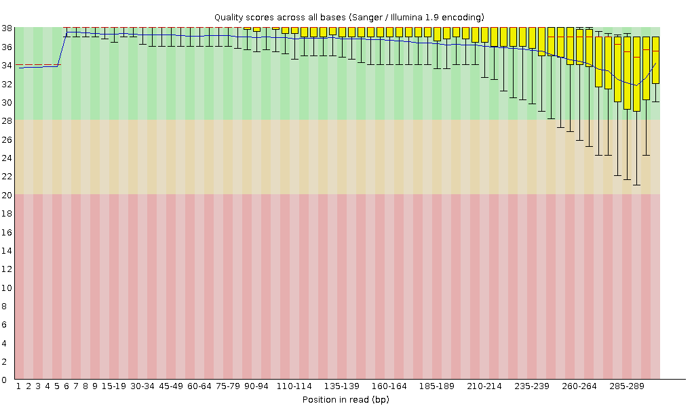

# Day 1 Protocol

Learned some Linux commands, most of them were familiar for me.

[Linux cheat sheet](https://files.fosswire.com/2007/08/fwunixref.pdf)

New ones:
- chmod (including numerical parameters 4 - read, 2 - write, 1 - execute). First group is the root user, then the group user, and lastly the users the file is shared with (world). \
  ``` chmod 777 filename.extension #all permissions for everyone ```

How to access the cluster of CAU:

```bash
ssh -X sunam___@caucluster.rz.uni-kiel.de
```

Then enter the password.

Learned about environments.

****************
# Day 2 Protocol
## Lecture highlights
- Workflow for metagenomic analysis
- De Brujn graph for contig generation from short reads
- Some history of genomics

## Quality control, trimming, assembly

1. Connect the caucluster.
2. Go to working directory.
3. Load the required modules.
4. Activate the modules.


This is the bash script template for running jobs in caucluster, which includes some of the aforementioned steps:

``` bash 
#!/bin/bash
#SBATCH --job-name=fastqc
#SBATCH --output=fastqc.out
#SBATCH --error=fastqc.err
#SBATCH --nodes=1
#SBATCH --ntasks-per-node=1
#SBATCH --cpus-per-task=12
#SBATCH --mem=25G
#SBATCH --partition=base
#SBATCH --time=5:00:00
#SBATCH --reservation=biol217

#load necessary modules
module load gcc12-env/12.1.0
module load micromamba/1.4.2
eval "$(micromamba shell hook --shell=bash)"
export MAMBA_ROOT_PREFIX=$WORK/.micromamba

cd $WORK

micromamba activate .micromamba/envs/00_anvio/
# WRITE YOUR COMMANDS

# ##----------------- End -------------
module purge
jobinfo
```

**************

### Quality control:
``` bash
for file in /work_beegfs/sunam230/metagenomics/0_raw_reads/*.gz; do
    fastqc "${file}" -o /work_beegfs/sunam230/metagenomics/fastqc_output/
done
```
Result (from .html file):


Output: fastqc.zip files with information about quality only, no raw reads there.

### Cleaning the data:

```
fastp -i /work_beegfs/sunam230/metagenomics/0_raw_reads/BGR_130305_mapped_R1.fastq.gz -I /work_beegfs/sunam230/metagenomics/0_raw_reads/BGR_130305_mapped_R2.fastq.gz -R fastp_report1 -o /work_beegfs/sunam230/metagenomics/fastp_output/130305_R1_clean.fastq.gz -O /work_beegfs/sunam230/metagenomics/fastp_output/130305_R2_clean.fastq.gz -t 6 -q 20
fastp -i /work_beegfs/sunam230/metagenomics/0_raw_reads/BGR_130527_mapped_R1.fastq.gz -I /work_beegfs/sunam230/metagenomics/0_raw_reads/BGR_130527_mapped_R2.fastq.gz -R fastp_report2 -o /work_beegfs/sunam230/metagenomics/fastp_output/130587_R1_clean.fastq.gz -O /work_beegfs/sunam230/metagenomics/fastp_output/130587_R2_clean.fastq.gz -t 6 -q 20
fastp -i /work_beegfs/sunam230/metagenomics/0_raw_reads/BGR_130708_mapped_R1.fastq.gz -I /work_beegfs/sunam230/metagenomics/0_raw_reads/BGR_130708_mapped_R2.fastq.gz -R fastp_report3 -o /work_beegfs/sunam230/metagenomics/fastp_output/130708_R1_clean.fastq.gz -O /work_beegfs/sunam230/metagenomics/fastp_output/130708_R2_clean.fastq.gz -t 6 -q 20
```
Output: fastq.gz files with cleaned (trimmed) reads.

### Assembly:
```
megahit -1 /work_beegfs/sunam230/metagenomics/fastp_output/130305_R1_clean.fastq.gz -1 /work_beegfs/sunam230/metagenomics/fastp_output/130587_R1_clean.fastq.gz -1 /work_beegfs/sunam230/metagenomics/fastp_output/130708_R1_clean.fastq.gz -2 /work_beegfs/sunam230/metagenomics/fastp_output/130305_R2_clean.fastq.gz -2 /work_beegfs/sunam230/metagenomics/fastp_output/130587_R2_clean.fastq.gz -2 /work_beegfs/sunam230/metagenomics/fastp_output/130708_R2_clean.fastq.gz --min-contig-len 1000 --presets meta-large -m 0.85 -o /work_beegfs/sunam230/metagenomics/assembly_output/ -t 12  
```

Kept running overnight.
**************


### Errors&mistakes:
- Typos in path
  > no backslash in the beginning of the path
- Wrong directory of the .sh script

Used this [MD cheat sheet](https://enterprise.github.com/downloads/en/markdown-cheatsheet.pdf)


