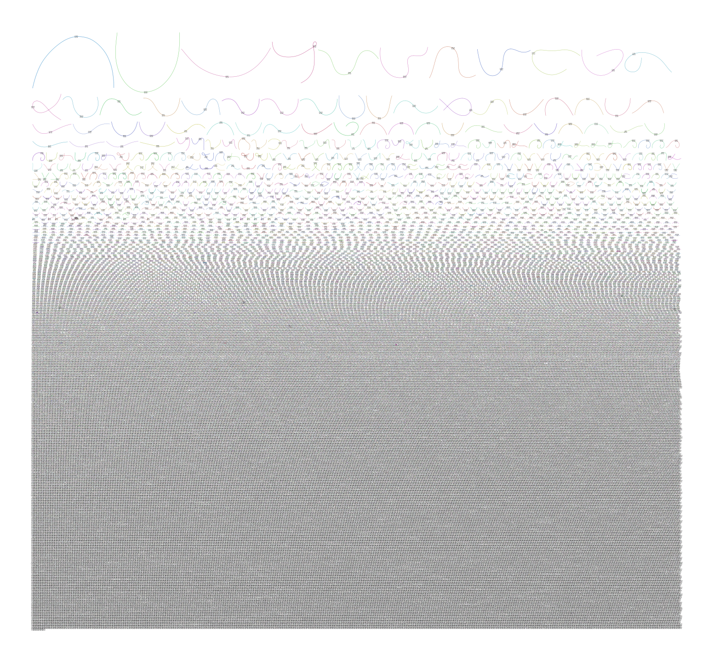
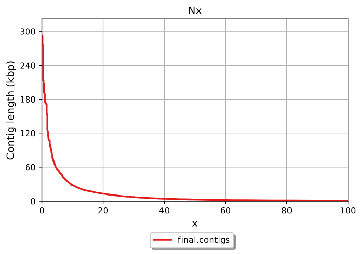

# Day 1 Protocol

Learned some Linux commands, most of them were familiar for me.

[Linux cheat sheet](https://files.fosswire.com/2007/08/fwunixref.pdf)

New ones:
- chmod (including numerical parameters 4 - read, 2 - write, 1 - execute). First group is the root user, then the group user, and lastly the users the file is shared with (world). \
  ``` chmod 777 filename.extension #all permissions for everyone ```

How to access the cluster of CAU:

```bash
ssh -X sunam___@caucluster.rz.uni-kiel.de
```

Then enter the password.

Learned about environments.

****************
# Day 2 Protocol
## Lecture highlights
- Workflow for metagenomic analysis
- De Brujn graph for contig generation from short reads
- Some history of genomics

## Quality control, trimming, assembly

1. Connect the caucluster.
2. Go to working directory.
3. Load the required modules.
4. Activate the modules.


This is the bash script template for running jobs in caucluster, which includes some of the aforementioned steps:

``` bash 
#!/bin/bash
#SBATCH --job-name=fastqc
#SBATCH --output=fastqc.out
#SBATCH --error=fastqc.err
#SBATCH --nodes=1
#SBATCH --ntasks-per-node=1
#SBATCH --cpus-per-task=12
#SBATCH --mem=25G
#SBATCH --partition=base
#SBATCH --time=5:00:00
#SBATCH --reservation=biol217

#load necessary modules
module load gcc12-env/12.1.0
module load micromamba/1.4.2
eval "$(micromamba shell hook --shell=bash)"
export MAMBA_ROOT_PREFIX=$WORK/.micromamba

cd $WORK

micromamba activate .micromamba/envs/00_anvio/
# WRITE YOUR COMMANDS

# ##----------------- End -------------
module purge
jobinfo
```

**************

### Quality control:
``` bash
for file in /work_beegfs/sunam230/metagenomics/0_raw_reads/*.gz; do
    fastqc "${file}" -o /work_beegfs/sunam230/metagenomics/fastqc_output/
done
```
Result (from .html file):


Output: fastqc.zip files with information about quality only, no raw reads there.

### Cleaning the data:

```
fastp -i /work_beegfs/sunam230/metagenomics/0_raw_reads/BGR_130305_mapped_R1.fastq.gz -I /work_beegfs/sunam230/metagenomics/0_raw_reads/BGR_130305_mapped_R2.fastq.gz -R fastp_report1 -o /work_beegfs/sunam230/metagenomics/fastp_output/130305_R1_clean.fastq.gz -O /work_beegfs/sunam230/metagenomics/fastp_output/130305_R2_clean.fastq.gz -t 6 -q 20
fastp -i /work_beegfs/sunam230/metagenomics/0_raw_reads/BGR_130527_mapped_R1.fastq.gz -I /work_beegfs/sunam230/metagenomics/0_raw_reads/BGR_130527_mapped_R2.fastq.gz -R fastp_report2 -o /work_beegfs/sunam230/metagenomics/fastp_output/130587_R1_clean.fastq.gz -O /work_beegfs/sunam230/metagenomics/fastp_output/130587_R2_clean.fastq.gz -t 6 -q 20
fastp -i /work_beegfs/sunam230/metagenomics/0_raw_reads/BGR_130708_mapped_R1.fastq.gz -I /work_beegfs/sunam230/metagenomics/0_raw_reads/BGR_130708_mapped_R2.fastq.gz -R fastp_report3 -o /work_beegfs/sunam230/metagenomics/fastp_output/130708_R1_clean.fastq.gz -O /work_beegfs/sunam230/metagenomics/fastp_output/130708_R2_clean.fastq.gz -t 6 -q 20
```
Output: fastq.gz files with cleaned (trimmed) reads.

### Assembly:
```
megahit -1 /work_beegfs/sunam230/metagenomics/fastp_output/130305_R1_clean.fastq.gz -1 /work_beegfs/sunam230/metagenomics/fastp_output/130587_R1_clean.fastq.gz -1 /work_beegfs/sunam230/metagenomics/fastp_output/130708_R1_clean.fastq.gz -2 /work_beegfs/sunam230/metagenomics/fastp_output/130305_R2_clean.fastq.gz -2 /work_beegfs/sunam230/metagenomics/fastp_output/130587_R2_clean.fastq.gz -2 /work_beegfs/sunam230/metagenomics/fastp_output/130708_R2_clean.fastq.gz --min-contig-len 1000 --presets meta-large -m 0.85 -o /work_beegfs/sunam230/metagenomics/assembly_output/ -t 12  
```

Kept running overnight.
**************


### Errors&mistakes:
- Typos in path
  > no backslash in the beginning of the path
- Wrong directory of the .sh script

Used this [MD cheat sheet](https://enterprise.github.com/downloads/en/markdown-cheatsheet.pdf)


# Day 3 Protocol
## Assembly visualisation


```bash

```


```bash

```



We used Bandage software to open .fastg files (we obtained them after converting the final assembly .fa files).

### Questions
We see a lot of small contigs and a small number of big ones (more than 1000 bp).

## Quality assessment of assembly

```bash

```

    What is your N50 value? Why is this value relevant?
    How many contigs are assembled?
    What is the total length of the contigs?
### N50

>N50 is low (3014). It is which length
### Number of contigs
55837 
### Total length
142642422


## Genome Binning
### Preparations and mapping
format your fasta sequence IDs
```bash
anvi-script-reformat-fasta /work_beegfs/sunam230/metagenomics/assembly_output/final.contigs.fa -o /work_beegfs/sunam230/metagenomics/assembly_output/contigs.anvio.fa --min-len 1000 --simplify-names --report-file name_conversion.txt
```

Use the following command to index your mapping reference fasta file.
```bash
bowtie2-build /work_beegfs/sunam230/metagenomics/assembly_output/contigs.anvio.fa /work_beegfs/sunam230/metagenomics/assembly_output/contigs.anvio.fa.index
```
Now use bowtie2 for the actual mapping.
```bash
cd /work_beegfs/sunam230/metagenomics/fastp_output/

for i in *_R1_clean.fastq.gz; do
  base="${i%_R1_clean.fastq.gz}"; bowtie2 --very-fast -x /work_beegfs/sunam230/metagenomics/assembly_output/contigs.anvio.fa.index -1 $i -2 "$base"_R2_clean.fastq.gz -S /work_beegfs/sunam230/metagenomics/mapping/"${base}".sam 
done
```

sequence mapping file (SAM) with the .sam extension and which we convert to binary alignment and map (BAM). Then contigs.db generation and HMM search (adds hmm.hits into contigs.db).
```bash
for i in /work_beegfs/sunam230/metagenomics/mapping/*.sam; do samtools view -bS $i > "$i".bam; done

anvi-gen-contigs-database -f /work_beegfs/sunam230/metagenomics/assembly_output/contigs.anvio.fa -o contigs.db -n 'biol217'

anvi-run-hmms -c contigs.db --num-threads 12
```

### Visualisation of contigs.db in ANVI´O interactive
In terminal:
```bash
srun --pty --x11 --partition=interactive --nodes=1 --tasks-per-node=1 --cpus-per-task=1 --mem=10G --time=01:00:00 /bin/bash
```
We started a server. 
`note down which node this command logged you on`

```
module load gcc12-env/12.1.0
module load micromamba
micromamba activate $WORK/.micromamba/envs/00_anvio/
```

`Run the command to display what you want`

Then open a new terminal
```
ssh -L 8080:localhost:8080 sunam230@caucluster.rz.uni-kiel.de
```
```
ssh -L 8080:localhost:8080 n# #replace the node number
```

http://127.0.0.1:8080/


Then close the connection with `ctrl c`
```
exit
```
# if the host is busy, try 8080 instead of 8060

http://127.0.0.1:8060/


****************

### Profiling with ANVI´O

>Sort and Index bam files
```bash
for i in *.bam; do anvi-init-bam $i -o "$i".sorted.bam; done
```

>Creating an Anvi’o Profile
```bash
cd /work_beegfs/sunam230/metagenomics/mapping/
for i in *.sorted.bam; do
    base=$(basename "$i" .sam.bam.sorted.bam)
    anvi-profile -i "$i" -c contigs.db -o ../profiling/${base}
done
```

>merge the profiles coming from your different samples into one profile:
```bash
anvi-merge /work_beegfs/sunam230/metagenomics/profiling/130305/PROFILE.db /work_beegfs/sunam230/metagenomics/profiling/130587/PROFILE.db /work_beegfs/sunam230/metagenomics/profiling/130708/PROFILE.db -o /work_beegfs/sunam230/metagenomics/profiling/merged_profiles/ -c /work_beegfs/sunam230/metagenomics/mapping/contigs.db --enforce-hierarchical-clustering
```

## Binning with Metabat2
```bash
anvi-cluster-contigs -p /work_beegfs/sunam230/metagenomics/profiling/merged_profiles/PROFILE.db -c /work_beegfs/sunam230/metagenomics/mapping/contigs.db -C METABAT2 --driver metabat2 --just-do-it --log-file log-metabat2

anvi-summarize -p /work_beegfs/sunam230/metagenomics/profiling/merged_profiles/PROFILE.db -c /work_beegfs/sunam230/metagenomics/mapping/contigs.db -o SUMMARY_METABAT2 -C METABAT2
```
## Binning with MaxBin2
```bash
anvi-cluster-contigs -p /work_beegfs/sunam230/metagenomics/profiling/merged_profiles/PROFILE.db -c /work_beegfs/sunam230/metagenomics/mapping/contigs.db -C MAXBIN2 --driver maxbin2 --just-do-it --log-file log-maxbin2

anvi-summarize -p /work_beegfs/sunam230/metagenomics/profiling/merged_profiles/PROFILE.db -c /work_beegfs/sunam230/metagenomics/mapping/contigs.db -o SUMMARY_MAXBIN2 -C MAXBIN2
```
Results:
[Metabat2 result](./resourses/index.html)
[MaxBin2 result](./resourses/indexmaxbin.html)
### Questions answers
- 3 archaea bins in METABAT2
- 1 archaea bin in MaxBin2

## Quality assessment of MAGs
Estimate your genomes completeness and contamination levels.
You can assess the quality of your bins by using
```bash
anvi-estimate-genome-completeness -c /work_beegfs/sunam230/metagenomics/mapping/contigs.db -p /work_beegfs/sunam230/metagenomics/profiling/merged_profiles/PROFILE.db -C METABAT2
```
If you want to check what collections you generated you can use:
```bash
anvi-estimate-genome-completeness -p /work_beegfs/sunam230/metagenomics/profiling/merged_profiles/PROFILE.db -c /work_beegfs/sunam230/metagenomics/mapping/contigs.db --list-collections
```
In interactive (ternimal + server):
```bash
anvi-interactive -p ./merged_profiles/PROFILE.db -c ../mapping/contigs.db -C METABAT2
```

### Questions
    Which binning strategy gives you the best quality for the A R C H A E A bins??
              Metabat2:   
    domain   |   confidence |   % completion |   % redundancy |   num_splits |   total length |
    ARCHAEA  |          0.3 |          38.16 |              0 |          135 |         443275 
    ARCHAEA  |          0.3 |          48.68 |           9.21 |          353 |        1317425 
    ARCHAEA  |            1 |          98.68 |           2.63 |          262 |        1818443 
              MaxBin2:
    ARCHAEA  |          0.8 |          94.74 |          73.68 |          922 |        3144170 |
    How many A R C H A E A bins do you get that are of High Quality? How many B A C T E R I A bins do you get that are of High Quality?

********************
# Day 4 Protocol - Bin refinement
## Chimera detection in MAGs
 ```bash
cd $WORK

module load gcc12-env/12.1.0
module load micromamba/1.3.1
micromamba activate 00_gunc

cd /work_beegfs/sunam230/metagenomics/profiling/ARCHAEA_BIN_REFINEMENT
mkdir /work_beegfs/sunam230/metagenomics/profiling/06_gunc/

for i in *.fa; do mkdir /work_beegfs/sunam230/metagenomics/profiling/06_gunc/"$i"_out; done

for i in *.fa; do
  gunc run -i "$i" -r $WORK/databases/gunc/gunc_db_progenomes2.1.dmnd --out_dir /work_beegfs/sunam230/metagenomics/profiling/06_gunc/"$i"_out --threads 8 --detailed_output
done
```

> Visualize
- #is the number of your bin
```bash
cd /work_beegfs/sunam###/metagenomics/06_gunc/METABAT__###-contigs.fa_out
gunc plot -d ./diamond_output/METABAT__#-contigs.diamond.progenomes_2.1.out -g ./gene_calls/gene_counts.json
```

### QUESTIONS
- Do you get A R C H A E A bins that are chimeric?
  > yes, 40 and 23 a bit. But now we exclude only 40 as others are ok, but later on species clusterization we will take only 17

genome	n_genes_called	n_genes_mapped	n_contigs	taxonomic_level	proportion_genes_retained_in_major_clades	genes_retained_index	clade_separation_score	contamination_portion	n_effective_surplus_clades	mean_hit_identity	reference_representation_score	pass.GUNC
MAXBIN__011-contigs	3829	3514	894	kingdom	1.0	0.92	0.65	0.03	0.06	0.87	0.8	False
MAXBIN__011-contigs	3829	3514	894	phylum	0.97	0.89	0.0	0.0	0.0	0.88	0.78	True
MAXBIN__011-contigs	3829	3514	894	class	0.96	0.88	0.0	0.0	0.0	0.89	0.78	True
MAXBIN__011-contigs	3829	3514	894	order	0.95	0.87	0.0	0.0	0.0	0.89	0.77	True
MAXBIN__011-contigs	3829	3514	894	family	0.95	0.87	0.0	0.0	0.0	0.89	0.77	True
MAXBIN__011-contigs	3829	3514	894	genus	0.93	0.85	0.0	0.0	0.0	0.89	0.76	True
MAXBIN__011-contigs	3829	3514	894	species	0.87	0.8	0.41	0.49	1.13	0.9	0.72	True

genome	n_genes_called	n_genes_mapped	n_contigs	taxonomic_level	proportion_genes_retained_in_major_clades	genes_retained_index	clade_separation_score	contamination_portion	n_effective_surplus_clades	mean_hit_identity	reference_representation_score	pass.GUNC
METABAT__17-contigs	1970	1893	261	kingdom	0.99	0.95	0.0	0.0	0.0	0.83	0.79	True
METABAT__17-contigs	1970	1893	261	phylum	0.98	0.94	0.0	0.0	0.0	0.83	0.79	True
METABAT__17-contigs	1970	1893	261	class	0.98	0.94	0.0	0.0	0.0	0.83	0.79	True
METABAT__17-contigs	1970	1893	261	order	0.97	0.93	0.0	0.0	0.0	0.84	0.78	True
METABAT__17-contigs	1970	1893	261	family	0.96	0.92	0.0	0.0	0.0	0.84	0.78	True
METABAT__17-contigs	1970	1893	261	genus	0.95	0.91	0.0	0.0	0.0	0.84	0.77	True
METABAT__17-contigs	1970	1893	261	species	0.89	0.85	0.1	0.37	1.04	0.85	0.72	True

genome	n_genes_called	n_genes_mapped	n_contigs	taxonomic_level	proportion_genes_retained_in_major_clades	genes_retained_index	clade_separation_score	contamination_portion	n_effective_surplus_clades	mean_hit_identity	reference_representation_score	pass.GUNC
METABAT__23-contigs	1551	1508	353	kingdom	1.0	0.97	0.0	0.0	0.0	0.96	0.93	True
METABAT__23-contigs	1551	1508	353	phylum	1.0	0.97	0.0	0.0	0.0	0.96	0.93	True
METABAT__23-contigs	1551	1508	353	class	0.99	0.97	0.0	0.0	0.0	0.96	0.93	True
METABAT__23-contigs	1551	1508	353	order	0.99	0.97	0.0	0.0	0.0	0.96	0.93	True
METABAT__23-contigs	1551	1508	353	family	0.99	0.96	0.0	0.0	0.0	0.96	0.93	True
METABAT__23-contigs	1551	1508	353	genus	0.98	0.95	0.0	0.0	0.0	0.97	0.92	True
METABAT__23-contigs	1551	1508	353	species	0.95	0.92	0.78	0.32	0.77	0.97	0.89	False

genome	n_genes_called	n_genes_mapped	n_contigs	taxonomic_level	proportion_genes_retained_in_major_clades	genes_retained_index	clade_separation_score	contamination_portion	n_effective_surplus_clades	mean_hit_identity	reference_representation_score	pass.GUNC
METABAT__40-contigs	451	436	135	kingdom	1.0	0.97	1.0	0.05	0.1	0.96	0.93	False
METABAT__40-contigs	451	436	135	phylum	1.0	0.96	1.0	0.04	0.09	0.96	0.93	False
METABAT__40-contigs	451	436	135	class	0.99	0.96	1.0	0.04	0.08	0.97	0.93	False
METABAT__40-contigs	451	436	135	order	0.99	0.96	1.0	0.04	0.08	0.97	0.93	False
METABAT__40-contigs	451	436	135	family	0.98	0.95	1.0	0.03	0.06	0.97	0.92	False
METABAT__40-contigs	451	436	135	genus	0.98	0.95	1.0	0.03	0.05	0.97	0.92	False
METABAT__40-contigs	451	436	135	species	0.94	0.91	0.4	0.09	0.2	0.97	0.89	True

- hint: look at the CSS score (explained in the lecture) and the column PASS GUNC in the tables outputs per bin in your gunc_output folder.
  > CSS for METABAT_40 
- In your own words (2 sentences max), explain what is a chimeric bin.
  > It is a bin which contains genetic sequences from several taxa/strains which are closely related and hardly resolvable.
  
## Manual bin refinement

Done! In interactive:
```bash
module load gcc12-env/12.1.0
module load micromamba/1.3.1
micromamba activate 00_anvio
anvi-refine -c /work_beegfs/sunam230/metagenomics/mapping/contigs.db -C METABAT -p /work_beegfs/sunam230/metagenomics/profiling/merged_profiles/PROFILE.db --bin-id METABAT__17
```

  name        303    527   708
METABAT__17 	8.23 	5.31 	3.49
MAXBIN__011 	3.74 	3.18 	2.69
METABAT__23 	3.71 	1.34 	2.46
METABAT__40 	3.88 	0.05 	2.39


***********************
# Day 5 Protocol
## Taxonomic assignment
```bash
anvi-run-scg-taxonomy -c /work_beegfs/sunam230/metagenomics/mapping/contigs.db -T 20 -P 2

anvi-estimate-scg-taxonomy -c /work_beegfs/sunam230/metagenomics/mapping/contigs.db -p /work_beegfs/sunam230/metagenomics/profiling/merged_profiles/PROFILE.db --metagenome-mode --compute-scg-coverages --update-profile-db-with-taxonomy > temp.txt

anvi-summarize -p /work_beegfs/sunam230/metagenomics/profiling/merged_profiles/PROFILE.db -c /work_beegfs/sunam230/metagenomics/mapping/contigs.db -o /work_beegfs/sunam230/metagenomics/mapping/profiling/SUMMARY_METABAT2_FINAL -C METABAT2

```
### QUESTIONS
- Did you get a species assignment to the A R C H A E A bins previously identified?\
> Yes, metabat 17 - methanoculleus sp012797575, metabat 23 - methanoculleus thermohydrogenotrophicum, metabat 40 - methanosarcina flavescens
- Does the HIGH-QUALITY assignment of the bin need revision?\
> Metabat 17 is and was a high-quality tier (comp: 98.68% to 90.79%, red ), Metabat 23 is and was low quality (comp 48.68% to 47.37%, red 9.21% to 0.00%), metabat 40 is and was low quality (38.16% comp, 0% red).
