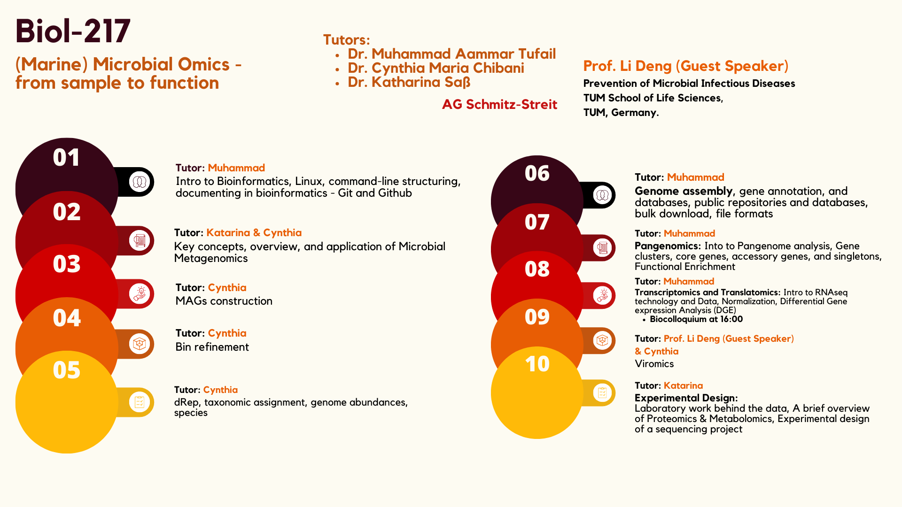

# Day 1 Protocol
## Nice
### Nya

- 1
- 2

1. Nya
2. Nya

**nya** \
*meow* \

> Highlight this

``` bash 
fastqc *.fastq
```

I use `fastq.gz` files for starting point.


[Link to Github repository](https://enterprise.github.com/downloads/en/markdown-cheatsheet.pdf)



