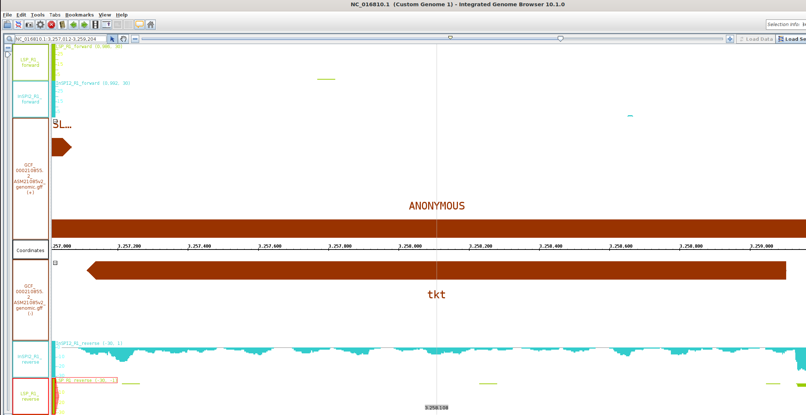

# Day 1 Protocol

Learned some Linux commands, most of them were familiar for me.

[Linux cheat sheet](https://files.fosswire.com/2007/08/fwunixref.pdf)

New ones:
- chmod (including numerical parameters 4 - read, 2 - write, 1 - execute). First group is the root user, then the group user, and lastly the users the file is shared with (world). \
  ``` chmod 777 filename.extension #all permissions for everyone ```

How to access the cluster of CAU:

```bash
ssh -X sunam___@caucluster.rz.uni-kiel.de
```

Then enter the password.

Learned about environments.

****************
# Day 2 Protocol
## Lecture highlights
- Workflow for metagenomic analysis
- De Brujn graph for contig generation from short reads
- Some history of genomics

## Quality control, trimming, assembly

1. Connect the caucluster.
2. Go to working directory.
3. Load the required modules.
4. Activate the modules.


This is the bash script template for running jobs in caucluster, which includes some of the aforementioned steps:

``` bash 
#!/bin/bash
#SBATCH --job-name=fastqc
#SBATCH --output=fastqc.out
#SBATCH --error=fastqc.err
#SBATCH --nodes=1
#SBATCH --ntasks-per-node=1
#SBATCH --cpus-per-task=12
#SBATCH --mem=25G
#SBATCH --partition=base
#SBATCH --time=5:00:00
#SBATCH --reservation=biol217

#load necessary modules
module load gcc12-env/12.1.0
module load micromamba/1.4.2
eval "$(micromamba shell hook --shell=bash)"
export MAMBA_ROOT_PREFIX=$WORK/.micromamba

cd $WORK

micromamba activate .micromamba/envs/00_anvio/
# WRITE YOUR COMMANDS

# ##----------------- End -------------
module purge
jobinfo
```

**************

### Quality control:
``` bash
for file in /work_beegfs/sunam230/metagenomics/0_raw_reads/*.gz; do
    fastqc "${file}" -o /work_beegfs/sunam230/metagenomics/fastqc_output/
done
```
Result (from .html file):


Output: fastqc.zip files with information about quality only, no raw reads there.

### Cleaning the data:

```
fastp -i /work_beegfs/sunam230/metagenomics/0_raw_reads/BGR_130305_mapped_R1.fastq.gz -I /work_beegfs/sunam230/metagenomics/0_raw_reads/BGR_130305_mapped_R2.fastq.gz -R fastp_report1 -o /work_beegfs/sunam230/metagenomics/fastp_output/130305_R1_clean.fastq.gz -O /work_beegfs/sunam230/metagenomics/fastp_output/130305_R2_clean.fastq.gz -t 6 -q 20
fastp -i /work_beegfs/sunam230/metagenomics/0_raw_reads/BGR_130527_mapped_R1.fastq.gz -I /work_beegfs/sunam230/metagenomics/0_raw_reads/BGR_130527_mapped_R2.fastq.gz -R fastp_report2 -o /work_beegfs/sunam230/metagenomics/fastp_output/130587_R1_clean.fastq.gz -O /work_beegfs/sunam230/metagenomics/fastp_output/130587_R2_clean.fastq.gz -t 6 -q 20
fastp -i /work_beegfs/sunam230/metagenomics/0_raw_reads/BGR_130708_mapped_R1.fastq.gz -I /work_beegfs/sunam230/metagenomics/0_raw_reads/BGR_130708_mapped_R2.fastq.gz -R fastp_report3 -o /work_beegfs/sunam230/metagenomics/fastp_output/130708_R1_clean.fastq.gz -O /work_beegfs/sunam230/metagenomics/fastp_output/130708_R2_clean.fastq.gz -t 6 -q 20
```
Output: fastq.gz files with cleaned (trimmed) reads.

### Assembly:
```
megahit -1 /work_beegfs/sunam230/metagenomics/fastp_output/130305_R1_clean.fastq.gz -1 /work_beegfs/sunam230/metagenomics/fastp_output/130587_R1_clean.fastq.gz -1 /work_beegfs/sunam230/metagenomics/fastp_output/130708_R1_clean.fastq.gz -2 /work_beegfs/sunam230/metagenomics/fastp_output/130305_R2_clean.fastq.gz -2 /work_beegfs/sunam230/metagenomics/fastp_output/130587_R2_clean.fastq.gz -2 /work_beegfs/sunam230/metagenomics/fastp_output/130708_R2_clean.fastq.gz --min-contig-len 1000 --presets meta-large -m 0.85 -o /work_beegfs/sunam230/metagenomics/assembly_output/ -t 12  
```

Kept running overnight.
**************


### Errors&mistakes:
- Typos in path
  > no backslash in the beginning of the path
- Wrong directory of the .sh script

Used this [MD cheat sheet](https://enterprise.github.com/downloads/en/markdown-cheatsheet.pdf)


# Day 3 Protocol
## Assembly visualisation


We used Bandage software to open .fastg files (we obtained them after converting the final assembly .fa files).

### Questions
We see a lot of small contigs and a small number of big ones (more than 1000 bp).

## Quality assessment of assembly

```bash

```

    What is your N50 value? Why is this value relevant?
    How many contigs are assembled?
    What is the total length of the contigs?
### N50

>N50 is low (3014). It is the sequence length of the shortest contig at 50% of the total assembly length.
### Number of contigs
55837 
### Total length
142642422


## Genome Binning
### Preparations and mapping
format your fasta sequence IDs
```bash
anvi-script-reformat-fasta /work_beegfs/sunam230/metagenomics/assembly_output/final.contigs.fa -o /work_beegfs/sunam230/metagenomics/assembly_output/contigs.anvio.fa --min-len 1000 --simplify-names --report-file name_conversion.txt
```

Use the following command to index your mapping reference fasta file.
```bash
bowtie2-build /work_beegfs/sunam230/metagenomics/assembly_output/contigs.anvio.fa /work_beegfs/sunam230/metagenomics/assembly_output/contigs.anvio.fa.index
```
Now use bowtie2 for the actual mapping.
```bash
cd /work_beegfs/sunam230/metagenomics/fastp_output/

for i in *_R1_clean.fastq.gz; do
  base="${i%_R1_clean.fastq.gz}"; bowtie2 --very-fast -x /work_beegfs/sunam230/metagenomics/assembly_output/contigs.anvio.fa.index -1 $i -2 "$base"_R2_clean.fastq.gz -S /work_beegfs/sunam230/metagenomics/mapping/"${base}".sam 
done
```

sequence mapping file (SAM) with the .sam extension and which we convert to binary alignment and map (BAM). Then contigs.db generation and HMM search (adds hmm.hits into contigs.db).
```bash
for i in /work_beegfs/sunam230/metagenomics/mapping/*.sam; do samtools view -bS $i > "$i".bam; done

anvi-gen-contigs-database -f /work_beegfs/sunam230/metagenomics/assembly_output/contigs.anvio.fa -o contigs.db -n 'biol217'

anvi-run-hmms -c contigs.db --num-threads 12
```

### Visualisation of contigs.db in ANVI´O interactive
In terminal:
```bash
srun --pty --x11 --partition=interactive --nodes=1 --tasks-per-node=1 --cpus-per-task=1 --mem=10G --time=01:00:00 /bin/bash
```
We started a server. 
`note down which node this command logged you on`

```
module load gcc12-env/12.1.0
module load micromamba
micromamba activate $WORK/.micromamba/envs/00_anvio/
```

`Run the command to display what you want`

Then open a new terminal
```
ssh -L 8080:localhost:8080 sunam230@caucluster.rz.uni-kiel.de
```
```
ssh -L 8080:localhost:8080 n# #replace the node number
```

http://127.0.0.1:8080/


Then close the connection with `ctrl c`
```
exit
```
# if the host is busy, try 8080 instead of 8060

http://127.0.0.1:8060/


****************

### Profiling with ANVI´O

>Sort and Index bam files
```bash
for i in *.bam; do anvi-init-bam $i -o "$i".sorted.bam; done
```

>Creating an Anvi’o Profile
```bash
cd /work_beegfs/sunam230/metagenomics/mapping/
for i in *.sorted.bam; do
    base=$(basename "$i" .sam.bam.sorted.bam)
    anvi-profile -i "$i" -c contigs.db -o ../profiling/${base}
done
```

>merge the profiles coming from your different samples into one profile:
```bash
anvi-merge /work_beegfs/sunam230/metagenomics/profiling/130305/PROFILE.db /work_beegfs/sunam230/metagenomics/profiling/130587/PROFILE.db /work_beegfs/sunam230/metagenomics/profiling/130708/PROFILE.db -o /work_beegfs/sunam230/metagenomics/profiling/merged_profiles/ -c /work_beegfs/sunam230/metagenomics/mapping/contigs.db --enforce-hierarchical-clustering
```

## Binning with Metabat2
```bash
anvi-cluster-contigs -p /work_beegfs/sunam230/metagenomics/profiling/merged_profiles/PROFILE.db -c /work_beegfs/sunam230/metagenomics/mapping/contigs.db -C METABAT2 --driver metabat2 --just-do-it --log-file log-metabat2

anvi-summarize -p /work_beegfs/sunam230/metagenomics/profiling/merged_profiles/PROFILE.db -c /work_beegfs/sunam230/metagenomics/mapping/contigs.db -o SUMMARY_METABAT2 -C METABAT2
```
## Binning with MaxBin2
```bash
anvi-cluster-contigs -p /work_beegfs/sunam230/metagenomics/profiling/merged_profiles/PROFILE.db -c /work_beegfs/sunam230/metagenomics/mapping/contigs.db -C MAXBIN2 --driver maxbin2 --just-do-it --log-file log-maxbin2

anvi-summarize -p /work_beegfs/sunam230/metagenomics/profiling/merged_profiles/PROFILE.db -c /work_beegfs/sunam230/metagenomics/mapping/contigs.db -o SUMMARY_MAXBIN2 -C MAXBIN2
```
Results:
[Metabat2 result](./resourses/index.html)
[MaxBin2 result](./resourses/indexmaxbin.html)
### Questions answers
- 3 archaea bins in METABAT2
- 1 archaea bin in MaxBin2

## Quality assessment of MAGs
Estimate your genomes completeness and contamination levels.
You can assess the quality of your bins by using
```bash
anvi-estimate-genome-completeness -c /work_beegfs/sunam230/metagenomics/mapping/contigs.db -p /work_beegfs/sunam230/metagenomics/profiling/merged_profiles/PROFILE.db -C METABAT2
```
If you want to check what collections you generated you can use:
```bash
anvi-estimate-genome-completeness -p /work_beegfs/sunam230/metagenomics/profiling/merged_profiles/PROFILE.db -c /work_beegfs/sunam230/metagenomics/mapping/contigs.db --list-collections
```
In interactive (ternimal + server):
```bash
anvi-interactive -p ./merged_profiles/PROFILE.db -c ../mapping/contigs.db -C METABAT2
```

### Questions
    Which binning strategy gives you the best quality for the A R C H A E A bins??
              Metabat2:   
    domain   |   confidence |   % completion |   % redundancy |   num_splits |   total length |
    ARCHAEA  |          0.3 |          38.16 |              0 |          135 |         443275 
    ARCHAEA  |          0.3 |          48.68 |           9.21 |          353 |        1317425 
    ARCHAEA  |            1 |          98.68 |           2.63 |          262 |        1818443 
              MaxBin2:
    ARCHAEA  |          0.8 |          94.74 |          73.68 |          922 |        3144170 |
    How many A R C H A E A bins do you get that are of High Quality? How many B A C T E R I A bins do you get that are of High Quality?
    21 High Quality bacteria, 1 archaea

********************
# Day 4 Protocol - Bin refinement
## Chimera detection in MAGs
 ```bash
cd $WORK

module load gcc12-env/12.1.0
module load micromamba/1.3.1
micromamba activate 00_gunc

cd /work_beegfs/sunam230/metagenomics/profiling/ARCHAEA_BIN_REFINEMENT
mkdir /work_beegfs/sunam230/metagenomics/profiling/06_gunc/

for i in *.fa; do mkdir /work_beegfs/sunam230/metagenomics/profiling/06_gunc/"$i"_out; done

for i in *.fa; do
  gunc run -i "$i" -r $WORK/databases/gunc/gunc_db_progenomes2.1.dmnd --out_dir /work_beegfs/sunam230/metagenomics/profiling/06_gunc/"$i"_out --threads 8 --detailed_output
done
```

> Visualize
- #is the number of your bin
```bash
cd /work_beegfs/sunam###/metagenomics/06_gunc/METABAT__###-contigs.fa_out
gunc plot -d ./diamond_output/METABAT__#-contigs.diamond.progenomes_2.1.out -g ./gene_calls/gene_counts.json
```

### QUESTIONS
- Do you get A R C H A E A bins that are chimeric?
  > yes, 40 and 23 a bit. But now we exclude only 40 as others are ok, but later on species clusterization we will take only 17


- hint: look at the CSS score (explained in the lecture) and the column PASS GUNC in the tables outputs per bin in your gunc_output folder.
  > CSS for METABAT_40 
- In your own words (2 sentences max), explain what is a chimeric bin.
  > It is a bin which contains genetic sequences from several taxa/strains which are closely related and hardly resolvable.
  
## Manual bin refinement

Done! In interactive:
```bash
module load gcc12-env/12.1.0
module load micromamba/1.3.1
micromamba activate 00_anvio
anvi-refine -c /work_beegfs/sunam230/metagenomics/mapping/contigs.db -C METABAT -p /work_beegfs/sunam230/metagenomics/profiling/merged_profiles/PROFILE.db --bin-id METABAT__17
```

  name        303    527   708
METABAT__17 	8.23 	5.31 	3.49
MAXBIN__011 	3.74 	3.18 	2.69
METABAT__23 	3.71 	1.34 	2.46
METABAT__40 	3.88 	0.05 	2.39


***********************
# Day 5 Protocol
## Taxonomic assignment
```bash
anvi-run-scg-taxonomy -c /work_beegfs/sunam230/metagenomics/mapping/contigs.db -T 20 -P 2

anvi-estimate-scg-taxonomy -c /work_beegfs/sunam230/metagenomics/mapping/contigs.db -p /work_beegfs/sunam230/metagenomics/profiling/merged_profiles/PROFILE.db --metagenome-mode --compute-scg-coverages --update-profile-db-with-taxonomy > temp.txt

anvi-summarize -p /work_beegfs/sunam230/metagenomics/profiling/merged_profiles/PROFILE.db -c /work_beegfs/sunam230/metagenomics/mapping/contigs.db -o /work_beegfs/sunam230/metagenomics/mapping/profiling/SUMMARY_METABAT2_FINAL -C METABAT2

```
### QUESTIONS
- Did you get a species assignment to the A R C H A E A bins previously identified?\
> Yes, metabat 17 - methanoculleus sp012797575, metabat 23 - methanoculleus thermohydrogenotrophicum, metabat 40 - methanosarcina flavescens
- Does the HIGH-QUALITY assignment of the bin need revision?\
> Metabat 17 is and was a high-quality tier (comp: 98.68% to 90.79%, red ), Metabat 23 is and was low quality (comp 48.68% to 47.37%, red 9.21% to 0.00%), metabat 40 is and was low quality (38.16% comp, 0% red).


*****************
# Day 6 Protocol
## Short reads qc
```bash
cd $WORK/genomics

module load gcc12-env/12.1.0
module load miniconda3/4.12.0
module load micromamba/1.4.2
micromamba activate 01_short_reads_qc

 mkdir -p $WORK/genomics/1_short_reads_qc/1_fastqc_raw
 for i in $WORK/genomics/0_raw_reads/short_reads/*.gz; do fastqc $i -o $WORK/genomics/1_short_reads_qc/1_fastqc_raw -t 16; done


 mkdir -p $WORK/genomics/1_short_reads_qc/2_cleaned_reads
 fastp -i $WORK/genomics/0_raw_reads/short_reads/241155E_R1.fastq.gz \
  -I $WORK/genomics/0_raw_reads/short_reads/241155E_R2.fastq.gz \
  -R $WORK/genomics/1_short_reads_qc/2_cleaned_reads/fastp_report \
  -h $WORK/genomics/1_short_reads_qc/2_cleaned_reads/report.html \
  -o $WORK/genomics/1_short_reads_qc/2_cleaned_reads/241155E_R1_clean.fastq.gz \
  -O $WORK/genomics/1_short_reads_qc/2_cleaned_reads/241155E_R2_clean.fastq.gz -t 6 -q 25


# 1.3 fastqc cleaned
mkdir -p $WORK/genomics/1_short_reads_qc/3_fastqc_cleaned
for i in $WORK/genomics/1_short_reads_qc/2_cleaned_reads/*.gz; do fastqc $i -o $WORK/genomics/1_short_reads_qc/3_fastqc_cleaned -t 12; done
micromamba deactivate
echo "---------short read cleaning completed successfully---------"
```


### Questions

- How Good is the read quality?
> Overall good, as if it was already trimmed, very few reads under 25 phred score
- How many reads do you had before trimming and how many do you have now?
> R1 before: 	1639549, R1 after: 	1613392
> R2 before: 1639549, R2 after: 	1613392
- Did the quality of the reads improve after trimming?
> A little, but sequence length distribution is not normal anymore


**************
## Long reads qc

```bash
module load gcc12-env/12.1.0
module load miniconda3/4.12.0
module load micromamba/1.4.2

echo "---------long reads cleaning started---------"

eval "$(micromamba shell hook --shell=bash)"
micromamba activate 02_long_reads_qc

# ## 2.1 Nanoplot raw
# cd $WORK/genomics/0_raw_reads/long_reads/
# mkdir -p $WORK/genomics/2_long_reads_qc/1_nanoplot_raw
# NanoPlot --fastq $WORK/genomics/0_raw_reads/long_reads/*.gz \
#  -o $WORK/genomics/2_long_reads_qc/1_nanoplot_raw -t 32 \
#  --maxlength 40000 --minlength 1000 --plots kde --format png \
#  --N50 --dpi 300 --store --raw --tsv_stats --info_in_report

# ## 2.2 Filtlong
# mkdir -p $WORK/genomics/2_long_reads_qc/2_cleaned_reads
# filtlong --min_length 1000 --keep_percent 90 $WORK/genomics/0_raw_reads/long_reads/*.gz | gzip > $WORK/genomics/2_long_reads_qc/2_cleaned_reads/241155E_cleaned_filtlong.fastq.gz

## 2.3 Nanoplot cleaned
cd $WORK/genomics/2_long_reads_qc/2_cleaned_reads
mkdir -p $WORK/genomics/2_long_reads_qc/3_nanoplot_cleaned
NanoPlot --fastq $WORK/genomics/2_long_reads_qc/2_cleaned_reads/*.gz \
 -o $WORK/genomics/2_long_reads_qc/3_nanoplot_cleaned -t 32 \
 --maxlength 40000 --minlength 1000 --plots kde --format png \
 --N50 --dpi 300 --store --raw --tsv_stats --info_in_report

micromamba deactivate

echo "---------long reads cleaning completed Successfully---------"

jobinfo
```

### Questions

- How Good is the long reads quality?
> Reads >Q10: 	11186 (70.1%) 102.2Mb
> Reads >Q15: 	1578 (9.9%) 12.8Mb
> After cleaning: 
> Reads >Q10: 	10521 (84.5%) 101.4Mb
> Reads >Q15: 	1527 (12.3%) 12.7Mb
- How many reads do you had before trimming and how many do you have now?
> Before: 15963, after: 12446
>
**********

## Assembly using Unicycler
```bash
echo "---------Unicycler Assembly pipeline started---------"
micromamba activate 03_unicycler
cd $WORK/genomics
mkdir -p $WORK/genomics/3_hybrid_assembly
unicycler -1 $WORK/genomics/1_short_reads_qc/2_cleaned_reads/241155E_R1_clean.fastq.gz -2 $WORK/genomics/1_short_reads_qc/2_cleaned_reads/241155E_R2_clean.fastq.gz -l $WORK/genomics/2_long_reads_qc/2_cleaned_reads/241155E_cleaned_filtlong.fastq.gz -o $WORK/genomics/3_hybrid_assembly/ -t 32
micromamba deactivate
echo "---------Unicycler Assembly pipeline Completed Successfully---------"
```

## QC of assembly
### Quast
```bash
echo "---------Assembly Quality Check Started---------"
cd $WORK
## 4.1 Quast (5 minutes)
module load gcc12-env/12.1.0
module load micromamba
eval "$(micromamba shell hook --shell=bash)"
export MAMBA_ROOT_PREFIX=$WORK/.micromamba
micromamba activate .micromamba/envs/04_quast

quast.py $WORK/genomics/3_hybrid_assembly/assembly.fasta --circos -L --conserved-genes-finding --rna-finding \
 --glimmer --use-all-alignments --report-all-metrics -o $WORK/genomics/3_hybrid_assembly/quast/ -t 16
micromamba deactivate

jobinfo
```


### Checkm
```bash
module load gcc12-env/12.1.0
module load micromamba
eval "$(micromamba shell hook --shell=bash)"
export MAMBA_ROOT_PREFIX=$WORK/.micromamba

cd $WORK

module load gcc12-env/12.1.0
module load miniconda3/4.12.0
module load micromamba/1.4.2
## 4.2 CheckM
micromamba activate .micromamba/envs/04_checkm
cd $WORK/genomics/3_hybrid_assembly
mkdir -p $WORK/genomics/3_hybrid_assembly/checkm
checkm lineage_wf $WORK/genomics/3_hybrid_assembly/ $WORK/genomics/3_hybrid_assembly/checkm -x fasta --tab_table --file $WORK/genomics/3_hybrid_assembly/checkm/checkm_results -r -t 32
checkm tree_qa $WORK/genomics/3_hybrid_assembly/checkm
checkm qa $WORK/genomics/3_hybrid_assembly/checkm/lineage.ms $WORK/genomics/3_hybrid_assembly/checkm/ -o 1 > $WORK/genomics/3_hybrid_assembly/checkm/Final_table_01.csv
checkm qa $WORK/genomics/3_hybrid_assembly/checkm/lineage.ms $WORK/genomics/3_hybrid_assembly/checkm/ -o 2 > $WORK/genomics/3_hybrid_assembly/checkm/final_table_checkm.csv
micromamba deactivate

jobinfo
```

#### Results

> Bin Id           Marker lineage         # genomes   # markers   # marker sets   Completeness   Contamination   Strain heterogeneity   Genome size (bp)   # ambiguous bases   # scaffolds   # contigs   N50 (scaffolds)   N50 (contigs)   Mean scaffold length (bp)   Mean contig length (bp)   Longest scaffold (bp)   Longest contig (bp)     GC    GC std (scaffolds > 1kbp)   Coding density   Translation table   # predicted genes   0    1    2   3   4   5+  
----------------------------------------------------------------------------------------------------------------------------------------------------------------------------------------------------------------------------------------------------------------------------------------------------------------------------------------------------------------------------------------------------------------------------------------------------------------------
> assembly   o__Bacteroidales (UID2657)      160         492           269           98.88            0.19               0.00               4454332                0                7            7           4332314          4332314                636333                     636333                  4332314                4332314         45.71              4.79                 88.90                11                 3904         3   488   1   0   0   0   


### checkm2
```bash
module load gcc12-env/12.1.0
module load micromamba
eval "$(micromamba shell hook --shell=bash)"
export MAMBA_ROOT_PREFIX=$WORK/.micromamba


# 4.3 Checkm2
# (can not work, maybe due to insufficient memory usage)
cd $WORK
micromamba activate .micromamba/envs/04_checkm2
cd $WORK/genomics/3_hybrid_assembly
mkdir -p $WORK/genomics/3_hybrid_assembly/checkm2
checkm2 predict --threads 32 --input $WORK/genomics/3_hybrid_assembly/assembly.fasta --output-directory $WORK/genomics/3_hybrid_assembly/checkm2 --force
micromamba deactivate
echo "---------Assembly Quality Check Completed Successfully---------"

jobinfo
```


#### Result


## Bandage


## Prokka annotation

```bash
# 5 Annotate-----------------------------------------------------------
echo "---------Prokka Genome Annotation Started---------"

cd $WORK
micromamba activate .micromamba/envs/05_prokka
cd $WORK/genomics/3_hybrid_assembly
# Prokka creates the output dir on its own
prokka $WORK/genomics/3_hybrid_assembly/assembly.fasta --outdir $WORK/genomics/4_annotated_genome --kingdom Bacteria --addgenes --cpus 32
micromamba deactivate
echo "---------Prokka Genome Annotation Completed Successfully---------"

jobinfo
```

## Classification GTDBTK
```bash
# 6 Classification-----------------------------------------------------------
echo "---------GTDB Classification Started---------"
# (can not work, maybe due to insufficient memory usage increase the ram in bash script)
cd $WORK
micromamba activate .micromamba/envs/06_gtdbtk
conda env config vars set GTDBTK_DATA_PATH="$WORK/databases/gtdbtk/release220";
cd $WORK
micromamba activate .micromamba/envs/06_gtdbtk
cd $WORK/genomics/4_annotated_genome
mkdir -p $WORK/genomics/5_gtdb_classification
echo "---------GTDB Classification will run now---------"
gtdbtk classify_wf --cpus 12 --genome_dir $WORK/genomics/4_annotated_genome/ --out_dir $WORK/genomics/5_gtdb_classification --extension .fna --skip_ani_screen
# reduce cpu and increase the ram in bash script in order to have best performance
micromamba deactivate
echo "---------GTDB Classification Completed Successfully---------"

jobinfo
```
### Result
d__Bacteria;p__Bacteroidota;c__Bacteroidia;o__Bacteroidales;f__Bacteroidaceae;g__Bacteroides;s__Bacteroides muris

## MultiQC
```bash
#!/bin/bash
#SBATCH --nodes=1
#SBATCH --cpus-per-task=8
#SBATCH --mem=16G
#SBATCH --time=0:20:00
#SBATCH --job-name=multiqc
#SBATCH --output=multiqc.out
#SBATCH --error=multiqc.err
#SBATCH --partition=base
#SBATCH --reservation=biol217
module load gcc12-env/12.1.0
module load micromamba
eval "$(micromamba shell hook --shell=bash)"
export MAMBA_ROOT_PREFIX=$WORK/.micromamba
cd $WORK
micromamba activate 01_short_reads_qc
multiqc -d $WORK/genomics/ -o $WORK/genomics/6_multiqc

jobinfo
```

## Results
Check mulriqc_report.html
*******************

# Questions

- **How good is the quality of genome?**
> Overall very good! > 98.88% completeness, 0.19% contaminations, and 6 contigs
- **Why did we use Hybrid assembler?**
> long reads can be used to cover the gaps or ambiguous short reads to improve the genome quality
- **What is the difference between short and long reads?**
> Short reads are short and usually read from both sides, long reads can be used to cover the gaps or ambiguous reads
- **Did we use Single or Paired end reads? Why?**
> Paired for short reads, single for long reads, because that is the availiable data from sequencing, + see answers above
- **Write down about the classification of genome we have used here**
> d__Bacteria;p__Bacteroidota;c__Bacteroidia;o__Bacteroidales;f__Bacteroidaceae;g__Bacteroides;s__Bacteroides muris with ANI of 97.07% (probably different strain)

> 
> **Resource to take help from:**
> 1. [Guide to bacterial genome assembly](https://github.com/rrwick/Perfect-bacterial-genome-tutorial/wiki)
> 2. [Perfect-bacterial-genome-tutorial](https://github.com/rrwick/Perfect-bacterial-genome-tutorial/wiki)

**************
# Day 7 Protocol

## Download the data

> i used gui of ncbi ;)
Downloaded.fna:
1. Pseudomonas putida
2. Pseudomonas tohonis
3. Pseudomonas cichorii
4. Pseudomonas chlororaphis


### Script
```bash
#!/bin/bash
#SBATCH --nodes=1
#SBATCH --cpus-per-task=16
#SBATCH --mem=32G
#SBATCH --time=5:00:00
#SBATCH --job-name=pseudomonas2
#SBATCH --output=pseudomonas2.out
#SBATCH --error=pseudomonas2.err
#SBATCH --partition=base
#SBATCH --reservation=biol217

module load gcc12-env/12.1.0
module load micromamba/1.4.2
eval "$(micromamba shell hook --shell=bash)"
cd $WORK
micromamba activate .micromamba/envs/00_anvio/

# go to your folder where you have all the genomes
cd $WORK/pangenomics2/

#1- rename files
for file in *.fna; do mv "$file" "${file%.fna}.fasta"; done

#2- Fast files to contigs DBs
#put genome into text file to make for loop
ls *fasta | awk 'BEGIN{FS="."}{print $1}' > genomes.txt
# reformat fasta files
for g in `cat genomes.txt`
do
    echo
    echo "Working on $g ..."
    echo
    anvi-script-reformat-fasta ${g}.fasta \
                               --min-len 2500 \
                               --simplify-names \
                               -o ${g}_2.5K.fasta
done

# Get the number of CPU cores
threads=12
name="pseudomonas"

#convert into contigs dbs
for g in `cat genomes.txt`
do
    echo
    echo "Working on $g ..." 
    echo
    anvi-gen-contigs-database -f ${g}_2.5K.fasta \
                              -o ${name}_${g}.db \
                              --num-threads $threads \
                              -n ${name}_${g}
done


#3- annotating contigs db
for g in *.db
do
    anvi-run-hmms -c $g --num-threads $threads
    anvi-run-ncbi-cogs -c $g --num-threads $threads
    anvi-scan-trnas -c $g --num-threads $threads
    anvi-run-scg-taxonomy -c $g --num-threads $threads
done


#4- creating an external genome file
anvi-script-gen-genomes-file --input-dir . \
                             -o external-genomes.txt

#5- Estimating contamination
anvi-estimate-genome-completeness -e external-genomes.txt
# check if refinement needed or turn off this

#6- computing a pangenome
anvi-gen-genomes-storage -e external-genomes.txt \
                         -o ${name}-GENOMES.db

anvi-pan-genome -g ${name}-GENOMES.db \
                --project-name ${name} \
                --num-threads $threads

#7- calculating average nucleotide identity ANI
anvi-compute-genome-similarity --external-genomes external-genomes.txt \
                               --program pyANI \
                               --output-dir ANI \
                               --num-threads $threads \
                               --pan-db ${name}/${name}-PAN.db 


#8- phylogenomic tree
anvi-get-sequences-for-gene-clusters -p ${name}/${name}-PAN.db \
                                     -g ${name}-GENOMES.db \
                                     --min-num-genomes-gene-cluster-occurs 4 \
                                     --max-num-genes-from-each-genome 1 \
                                     --concatenate-gene-clusters \
                                     --output-file ${name}/${name}-SCGs.fa

trimal -in ${name}/${name}-SCGs.fa \
         -out ${name}/${name}-SCGs-clean.fa \
         -gt 0.5

iqtree -s ${name}/${name}-SCGs-clean.fa \
       -m WAG \
       -bb 1000 \
       -nt $threads

# ##----------------- End -------------
module purge
jobinfo
```
## Results + highlighted clusters:


- Why these genomes?
> Pseudomonas is the first bacteria genus I thought of and these genomes have the green label of being high-quality 
- Number of genes in clusters:
> Single copy core genes: 8664 (38.52%) \
> Core genes: 1502 (6.68%) \
> Accessory genes: 5630 (25.03%) \
> Singletons: 6698  (29.78%) 


# Day 8 protocol
- TNOAR - total number of aligned reads

## Differential expression of example samples

*gene: ftsZ*

log2 fold change: 5.4 (upregulated)
**************
*gene: bioB*

log2 fold change: 4.6 (upregulated)
**************
*gene: tkt*

log2 fold change: 3.2 (upregulated)


## Our dataset - Methanosarcina mazei strain Gö1 (nitrogen conditions)
- type I glutamate--ammonia ligase CDS\

log2 fold change: -2.93 (downregulated)

- PstS family phosphate ABC transporter substrate-binding protein\

log2 fold change: -2.9 (downregulated)

- prephenate dehydrogenase

- log2 fold change: 1.9 (upregulated)

****************
# Day 9 Protocol - VIROMICS
## Questions

* How many viruses are in the BGR_140717 sample?
> 11 Proviruses and 846 viruses


<details><summary><b>Finished commands</b></summary>
  
```ssh
grep ">" -c 01_GENOMAD/BGR_140717/BGR_140717_Proviruses_Genomad_Output/proviruses_summary/proviruses_virus.fna

grep ">" -c 01_GENOMAD/BGR_140717/BGR_140717_Viruses_Genomad_Output/BGR_140717_modified_summary/BGR_140717_modified_virus.fna
```
</details>

***********

* **How many Caudoviricetes viruses in the BGR_***/ sample? Any other viral taxonomies?
> 614

- Briefly look up and describe these viruses (ds/ss DNA/RNA and hosts (euk/prok)
- 
> dsDNA, host is prokaryote

<details><summary><b>Finished commands</b></summary>
  
```ssh
grep -c "Caudoviricetes" 02_CHECK_V/BGR_130305/MVP_02_BGR_130305_Filtered_Relaxed_Merged_Genomad_CheckV_Virus_Proviruses_Quality_Summary.tsv
```
</details>

******************

* **How many Low-Quality/Medium-quality/High-quality/Complete viruses in the BGR_130305** sample

> 625 low quality, 0 medium quality, 0 high quality, 0 complete
<details><summary><b>Finished commands</b></summary>
  
```ssh
grep -c "Low-quality" 02_CHECK_V/BGR_130305/MVP_02_BGR_130305_Filtered_Relaxed_Merged_Genomad_CheckV_Virus_Proviruses_Quality_Summary.tsv
```
</details>

*************
### Here I switched to BGR_131021 because chose the unlucky low-quality ones before. lmao.
* **What is the length of the complete virus? How many viral hallmark genes?
> 46113 bp, 12 viral hallmark genes
* **Check how abundant is your complete virus in the different samples (RPKM)? Look into folders `04_READ_MAPPING/Subfolders/BGR_*_CoverM.tsv` and find your viruses.
> BGR_131021_NODE_96_length_46113_cov_32.412567 ------- 154.71898 RPKM
* **Create a table and summarize the RPKM value of the virus in the different samples. Or look into folder 05_VOTU_TABLES


**************

* Now let’s look at annotated genes in 06_FUNCTIONAL_ANNOTATION and find the table: 
`MVP_06_All_Sample_Filtered_Conservative_Merged_Genomad_CheckV_Representative_Virus_Proviruses_Gene_Annotation_GENOMAD_PHROGS_PFAM_Filtered.tsv`

* Now find/filter your complete virus and find the viral hallmark genes with a PHROG annotation (hint: look at the columns).

* **What are typical annotations you see? What could the functions be?  
> 'unknown' is the most common. Functions... probably capsid proteins
* **Now look for the category of “moron, auxiliary metabolic gene and host takeover” any toxin genes???? Quickly look up the function of this toxin (hint, vibrio phage and vibrio cholerae host)
> Zot-like toxin - "has the ability to increase mucosal permeability by reversibly affecting the structure of tight junctions" (https://pmc.ncbi.nlm.nih.gov/articles/PMC152047/) 'by interacting with a mammalian cell receptor with subsequent activation of intracellular signaling leading to the disassembly of the intercellular tight junctions' (https://www.jbc.org/article/S0021-9258(19)67052-3/fulltext)

*******************
*Now let’s look at the binning results. Look at 07_BINNING/07C_vBINS_READ_MAPPING/ and find table `MVP_07_Merged_vRhyme_Outputs_Unfiltered_best_vBins_Memberships_geNomad_CheckV_Summary_read_mapping_information_RPKM_Table.tsv`


* **How many High-quality viruses after binning? 
> 49
* **Are any of the identified viral contigs complete circular genomes (based on identifying direct terminal repeat regions on both ends of the genome)?
> Yes

*You can also look at the table  07D_vBINS_vOTUS_TABLES and find table: `MVP_07_Merged_vRhyme_Outputs_Filtered_conservative_best_vBins_Representative_Unbinned_vOTUs_geNomad_CheckV_Summary_read_mapping_information_RPKM_Table.tsv`

**************************
*Now finally let’s have a look at the potential predicted host of these complete viruses.
*Look into folder 08_iPHoP and find table: `Host_prediction_to_genome_m90.csv`
* What are the predicted hosts for your complete virus? are there multiple predicted hosts? are the hosts distantly related?
> BGR_140717_NODE_168_length_31258_cov_37.020094	BGR_130829_bin.14.strict	d__Bacteria;p__Bacillota_A;c__Clostridia;o__Tissierellales;f__Peptoniphilaceae;g__;s__
no mulriple hosts
* if not find 2 examples of viruses with multiple hosts predicted. for virus 1 closely related hosts and for virus 2 distantly related hosts.
> BGR_130305_NODE_1097_length_6048_cov_14.323544
closely related (Bacillus_A cereus_K, Bacillus_A mycoides etc)
>BGR_130305_NODE_1187_length_5781_cov_4.089591
distantly related (Clostridium_AE oryzae, Fervidobacterium pennivorans_A, etc)

* Discuss what might be the reasons based on 1) biological reasoning, 2) the prediction method or 3) potential contamination in host MAG that might result in such a prediction.
> 1) Distant hosts can have similar membrane proteins.
> 2) The prediction method: only blast is used in my case, may be mistaken binning.
> 3) Potential contamination in host MAG that might result in such a prediction is an option. Contamination of Clostridium with Fervidobacterium could lead to this (Fervidobacterium is mentioned twice for this virus in the table, so one could assume this is the real host)
